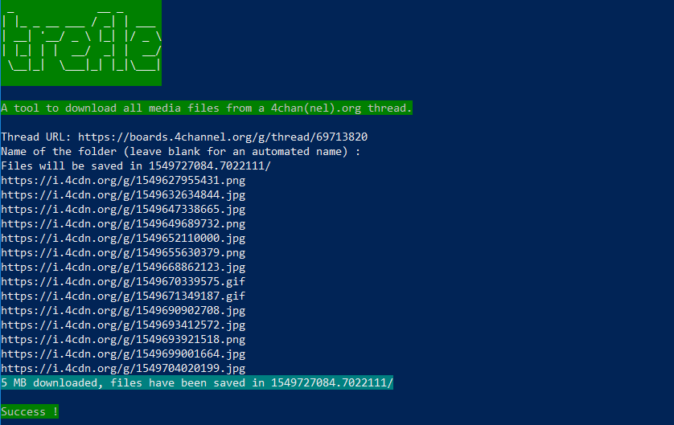

# trefle
A tool to download all media files from a 4chan(nel).org thread.

HOWTO : 
- paste the URL of the desired thread when prompted
- name the folder in which the files will be saved ( folders will be created in the script's current directory )
- files are renamed with a timestamp

